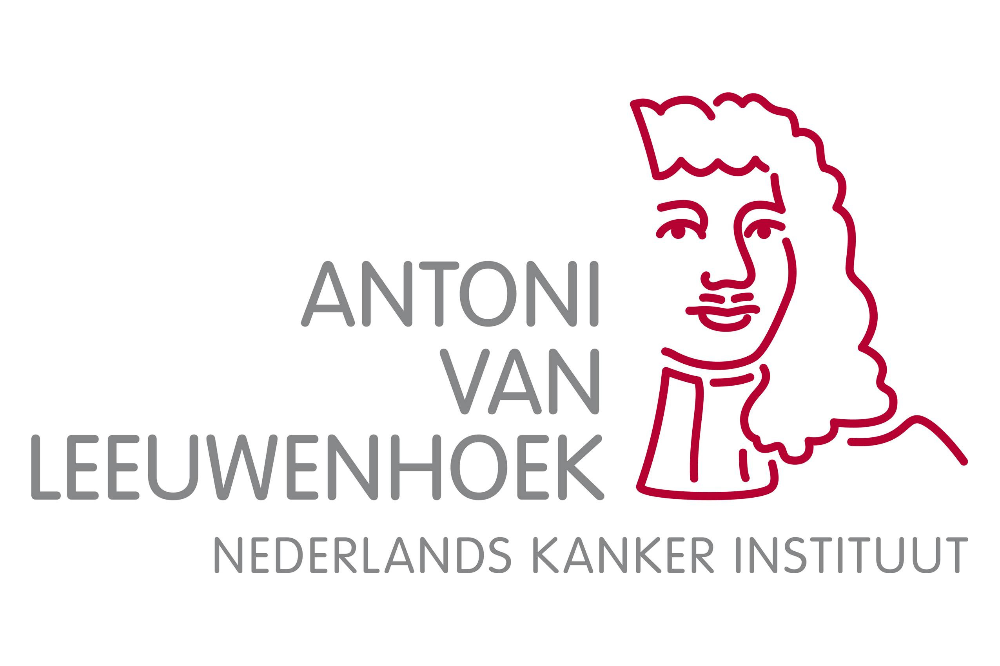

# The Client - Website

Ontwerp en maak een website voor een opdrachtgever en bespreek het resultaat tijdens de Sprint Review.

De instructie van deze leertaak staan in de [INSTRUCTIONS.md](https://github.com/fdnd-task/the-client-website/blob/main/docs/INSTRUCTIONS.md)


## Inhoudsopgave Readme

  * [Beschrijving](#beschrijving)
  * [Kenmerken](#kenmerken)
  * [Bronnen](#bronnen)
  * [Licentie](#licentie)

## Beschrijving
### Doel
Het doel van Oncollaboration is om radiotherapeuten uit Nederland en Indosnesië met elkaar te verbinden. De website dient als middel om informatie aan elkaar te verterstrekken voor verdere ontwikkeling van de radiotherapeuten in Indonesië d.m.v. het posten van webinars en onderzoeken van CT-scans. Met gebruik van een Q&A functie kunnen de gebruikers vragen stellen die andere kunnen beantwoorden.

### Uitstraling
#### homepage
Op de homepage krijgt de gebruiker gelijk een overzicht te zien met een introductie, overzicht van recente webinars met een filter optie en contourings. 

##### Intro
De intro laat in het design het recente nieuws zien zoals een nieuwe webinar die gepost is of een belangerijk artikel. Dit is aangepast naar een introductie zodat de gebruiker een welkom krijgt en meer informatie krijgt over de pagina.

##### Webinars
De webinars sectie laat de meest recente webinars zien met filter knoppen om de juiste webinar te tonen.

Elk webinar artikel bevat een titel, auteur, label en link naar de volledige post.
de kaartjes zijn obgebouwd uit articles. Deze bevatten een img, title, span als label, een paragraph voor de autheur en anchor tag om te linken naar de volledige post:


##### Contourings
Bij countouring lijkt het vrijwel hetzelfde enkel zijn er (nog) geen filters aanwezig.


<!-- In de Beschrijving staat hoe je project er uit ziet, hoe het werkt en wat je er mee kan. -->
<!-- Voeg een mooie poster visual toe 📸 -->
<!-- Voeg een link toe naar Github Pages 🌐-->

## Kenmerken
<!-- Bij Kenmerken staat welke technieken zijn gebruikt en hoe. Wat is de HTML structuur? Wat zijn de belangrijkste dingen in CSS? Wat is er met Javascript gedaan en hoe? Misschien heb je een framwork of library gebruikt? -->
Voor de website zijn verschillende conventies en waarden toegepast voor een overizchtelijke website. Zo is website gebouwd in mobile first en word er zoveel mogelijk genest in css:

### HTML
Voor de HTML is een duidelijk opzet zichtbaar. 

Voor goede leesbaarheid van de website word gebruik gemakkt van de juiste HTML tags. Zo staat de navigatie in de nav wat onderdeel is van een header en meer informatie van de pagina in de main:
```HTML
<header class="navbar wrappers">

         <!-- logo -->
            

        <div class="menu-toggle" id="mobile-menu"> <!-- hamburger menu -->
            <span class="bar"></span>
            <span class="bar"></span>
            <span class="bar"></span>
        </div>

        <nav> <!-- navigatie -->
            <ul class="nav-links">
                <li>
                    <a href="#">Webinars</a>
                    <ul class="submenu"> <!--submenu -->
                        <li><a href="#">Webinar</a></li>
                        <li><a href="#">Speaker</a></li>
                        <li><a href="#">Q&A</a></li>
                    </ul>
                </li>
                <li>
                    <a href="#">CT scans</a>
                    <ul><!-- sub- submenu -->
                        <li>
                            <a href="#">Q&A</a>
                        </li>
                        <li>
                            <a href="#">Case</a>
                            <ul>
                                <li><a href="#">Resource</a></li>
                            </ul>
                        </li>
                    </ul>
                </li>
                <li><a href="#">Account</a></li>
            </ul>
        </nav>
    </header>
```

De articles bevatten bijvooreeld allemaal een heading, img en anchor element:
```HTML
 <article class="webinar-article">
                    
                    <h3>IROS CME Webinar: Fractionation in Head..</h3>
                    <p>DR. Colin de Groot</p>
                    <div class="webinar-bottom">
                        <span class="webinar-label">onderzoek</span>
                        <a href="">Watch →</a>
                    </div>
                </article>
```
### CSS 
#### Nesting
Voor CSS heb ik alle styling op de zelfde volgorde als de HTML. In de CSS is gebruik gemaakt van nesting hierdoor heb ik minder/kortere selectors:
```CSS
.nav-links {
    list-style: none;
    display: flex;
    gap: 20px;
    
    li{ 
        position: relative;
     }

    li ul {
        display: none;
        position: absolute;
        top: 100%;
        left: 0;
        width: 8rem;
        background-color: var(--darkred);
        box-shadow: 0 4px 8px rgba(0, 0, 0, 0.1);
        padding: 10px 0;
    }
}
```
#### Mobile first
Tijdens het bouwen van de website word er rekening gehouden met mobile first. Op deze manier is de website volledig responsive. De mediaqueries worden ook genest zodat het makkelijker en sneller aan te passen is.
```CSS
.intro {
    display: flex;
    flex-direction: column;
    align-items: center;
    gap: 1rem;
    justify-content: space-between;

    @media (min-width:1050px) { 
        flex-direction: row; 
    }
}
```
### JS
Met javascript word er een hamburger menu gebouwd (enkel het menu is niet in mobile first gebouwd). Met een querry selector en toggle functie word er een class meegegeven/verwijderd waardoor er menu verschijnt en verdwijnd wannneer iemand op het menu klikt:
```JS
document.addEventListener('DOMContentLoaded', function() {
    const mobileMenu = document.getElementById('mobile-menu');
    const navLinks = document.querySelector('.nav-links');

    mobileMenu.addEventListener('click', function() {
        navLinks.classList.toggle('nav-active');
        console.log(navLinks)
    });
});
```
Met een console log word getest of de functie werkt en welke elementen worden terug gegeven.

## Licentie

This project is licensed under the terms of the [MIT license](./LICENSE).
